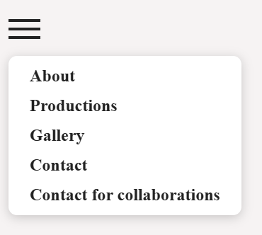

# Prisca Gagliani Caputo 77024A

---

## Idea of the project
- It is a professional Portfolio for the artist ALOREM
- It contains his biography, productions, photo gallery, and video
- It includes an interactive form to collaborate with the artist

---

## Purposes of the project
- Create a clear identity of the artist
- Use interactive contents
- Find new collaborations and fans

---

## What I have used – HTML
- Structure of the website

---

## What I have used – Other elements
- Hyperlinks
- Images and video

---

## What I have used – CSS
- Style for the different parts of the website
- Color and text variation

---

## What I have used – JavaScript
- Menu hamburger
- Collaboration form
- Cookie banner

---

## Website structure – Part 1
- Header with the artist logo
- About
- Productions
- Gallery

---

## Website structure – Part 2
- Instagram video
- Contact
- Collaborations form
- Footer

---

## Photo gallery
- Responsive layout
- Hover texts

---

## Collaborations form
- Name and surname
- Email validation

---

## Cookie banner
- Shown only at first access
- Preferences saved in LocalStorage
- Two options: accept / decline

---

# Thank you!